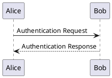

# PlantUml


```plantuml-diagram align="center" padding="10px" size="600px"
@startuml
Alice -> Bob: Authentication Request
Bob --> Alice: Authentication Response
@enduml
```

```
@startuml
Alice -> Bob: This will be displayed as code.
@enduml
```

