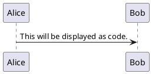

# Typemill

```plantuml-diagram
Alice -> Bob: Authentication Request
Bob --> Alice: Authentication Response
```

```plantuml
@startuml
Alice -> Bob: This will be displayed as code.
@enduml
```

Log in to the author area at [/tm/login](/tm/login).

